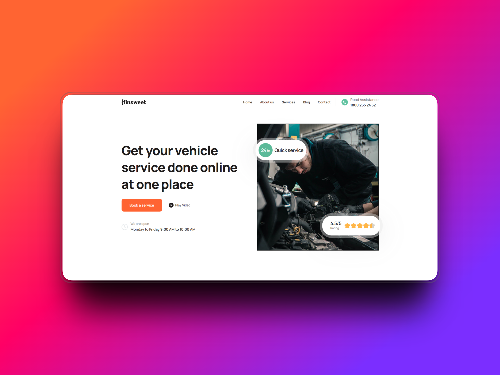

# Мой Первый Сайт

> Адаптивный лендинг по макету из Figma

## 🔗 Ссылки

- [Посмотреть сайт](https://kuksikabi.github.io/auto-service-landing/)
- [Figma макет prototype](https://www.figma.com/proto/iYQYutpzyf6WPv0eXla3xm/auto?node-id=482-447&t=Li4Eb1oC7Bzj6SBu-1)
- [Figma макет dev mode](https://www.figma.com/design/iYQYutpzyf6WPv0eXla3xm/auto?node-id=482-447&m=dev&t=Li4Eb1oC7Bzj6SBu-1у)

## 📝 Описание

Это мой первый адаптивный сайт, созданный на чистом HTML и CSS по макету из Figma.

### Особенности:
- ✅ Адаптивная вёрстка
- ✅ Семантический HTML
- ✅ Чистый CSS
- ✅ JS базированный на jquery
## 🛠 Технологии

- HTML5
- CSS3
- JS
## Контакты
- [Telegram](https://t.me/kuks1kabi)